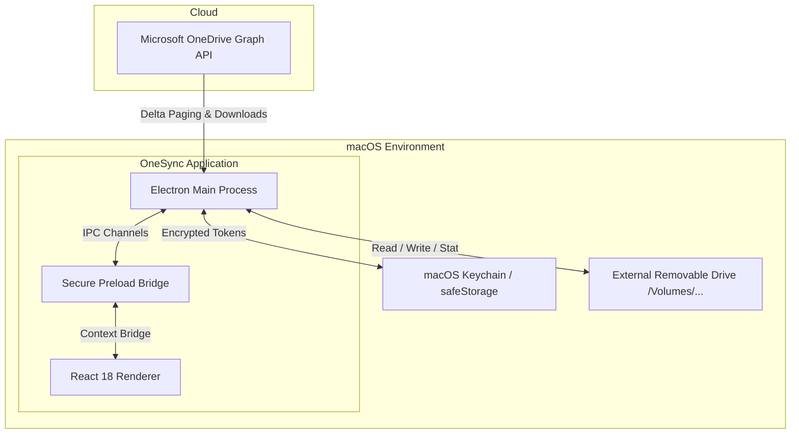
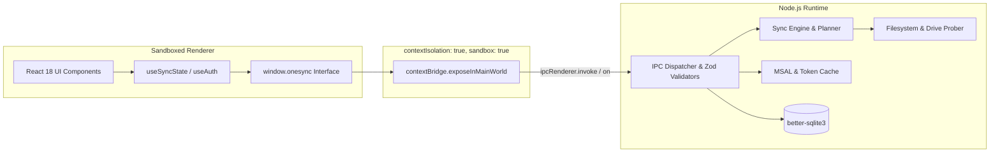
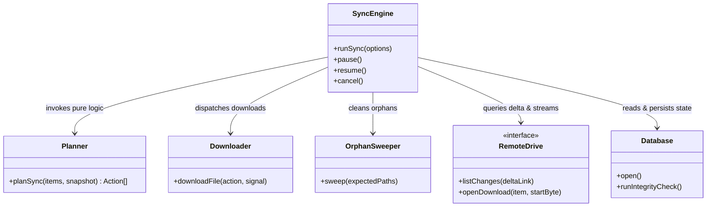
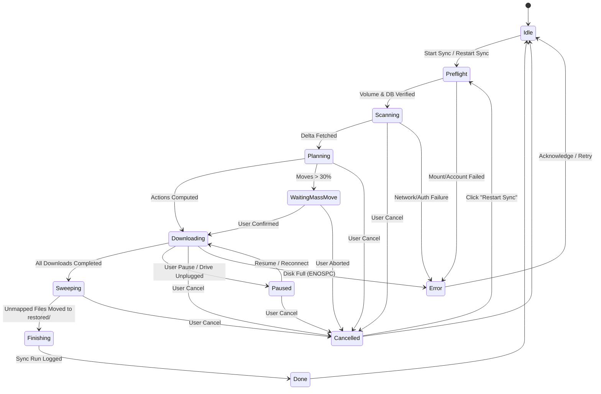

Author: https://sibansal.dev/

# OneSync — Architecture & System Design

## 1. Context Diagram



---

## 2. Process Model & Security Boundaries



- **Sandboxed Renderer:** Zero Node.js integration, zero raw filesystem or token access.
- **Preload Script:** Whitelists strictly typed functions and unidirectional event channels.
- **Main Process:** Handles network connections, crypto, SQLite, and external storage writes.

---

## 3. Module Map



---

## 4. Sync State Machine



---

## 5. Sync Sequence Diagram

```mermaid
sequenceDiagram
    autonumber
    actor User
    participant UI as Renderer UI
    participant Main as Main Process (SyncEngine)
    participant Graph as Microsoft Graph API
    participant Drive as External Drive (.onesync & onedrive/)

    User->>UI: Click "Sync Now"
    UI->>Main: ipc.invoke('sync:start')
    Main->>Drive: Stat volume, check dev ID, probe write
    Drive-->>Main: Volume verified & writable

    Main->>Graph: GET /me/drive/root/delta
    Graph-->>Main: Delta stream (new/modified items)
    Main->>Drive: Batch upsert remote items into state.db

    Main->>Drive: Stat snapshot of onedrive/ (in batches of 32)
    Drive-->>Main: Local stat dictionary

    Note over Main: Pure Planner: Evaluate 10-row Decision Table
    Main->>Main: planSync(dbItems, localSnapshot)

    loop Concurrent Downloads (Pool: 4 workers)
        Main->>Graph: Fetch fresh download URL
        Graph-->>Main: Temporary signed URL
        Main->>Drive: Stream bytes to .onesync/tmp/<id>.part with inline hashing
        Main->>Drive: Verify size & hash -> rename to onedrive/<path>
        Main->>Drive: Update item record in state.db
        Main-->>UI: emit('sync:progress', stats)
    end

    Main->>Drive: Sweep onedrive/ with opendir; move untracked to restored/
    Main->>Drive: Write sync_runs row, persist deltaLink
    Main-->>UI: emit('sync:state', { phase: 'idle' })
```

---

## 6. On-Disk Directory Structure

```
<SelectedFolder>/
├── .onesync/
│   ├── state.db              # Portable SQLite database (journal_mode=DELETE)
│   ├── state.db-journal      # Temporary rollback journal during transactions
│   └── tmp/                  # In-progress partial downloads
│       └── 01ABCDEF-1a2b3c4d.part
├── onedrive/                 # Exact one-way mirror of cloud OneDrive
│   ├── Documents/
│   │   └── Tax2025.pdf
│   └── Photos/
│       └── Sunset.jpg
└── restored/                 # Safe shelter for deleted / modified files
    ├── OldProjects/
    │   └── ArchivedReport.docx
    └── Documents/
        └── Tax2025 (restored 2026-09-19 142010).pdf
```

---

## 7. Failure Domains & Recovery Strategies

| Failure Domain | Symptom | Isolation & Recovery |
|---|---|---|
| **External Media Detachment** | Drive pulled out mid-stream (`ENOENT`, `EIO`, `ENXIO`) | Immediate pause of worker pool; no write fallback to root disk; temporary `.part` files remain in `<Folder>/.onesync/tmp/` on drive. Resumes upon reconnection. |
| **Out of Disk Space** | `ENOSPC` emitted during file stream | Run-level stop; UI alert; partial download flushed; all completed downloads stay in `synced` state in `state.db`. |
| **Corrupted SQLite State** | `PRAGMA integrity_check` fails on load | Old DB moved to `state.db.corrupt-<timestamp>`, fresh database initialized, Decision Table Row 10 (ADOPT) reconciles existing valid files by cryptographic hash without re-downloading. |
| **Authentication Expiry** | 401 Unauthorized from Microsoft Graph | Automated silent refresh attempt via MSAL token cache. If interactive re-auth is needed, triggers run-level pause for user sign-in. |
